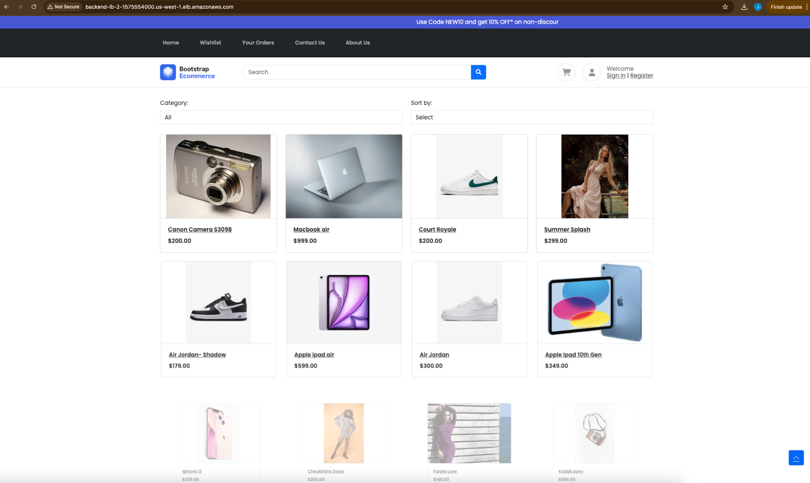
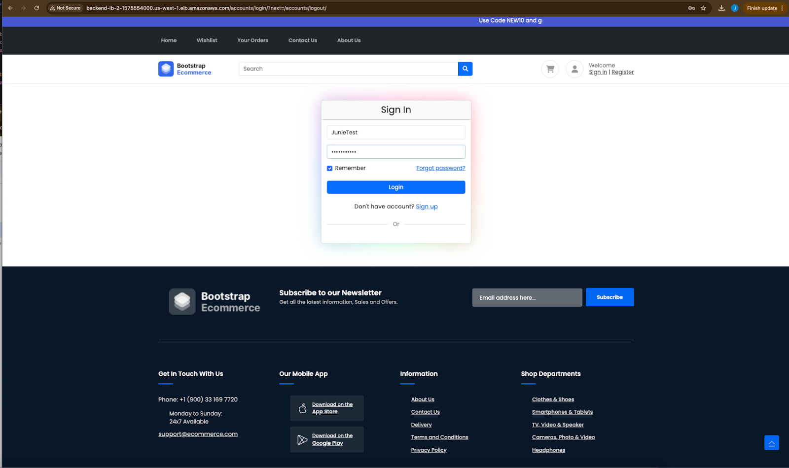
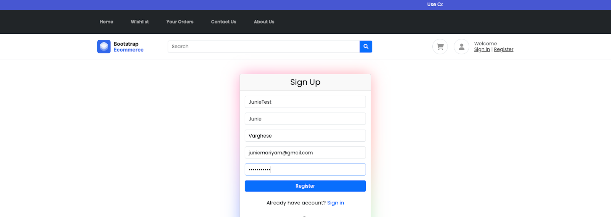
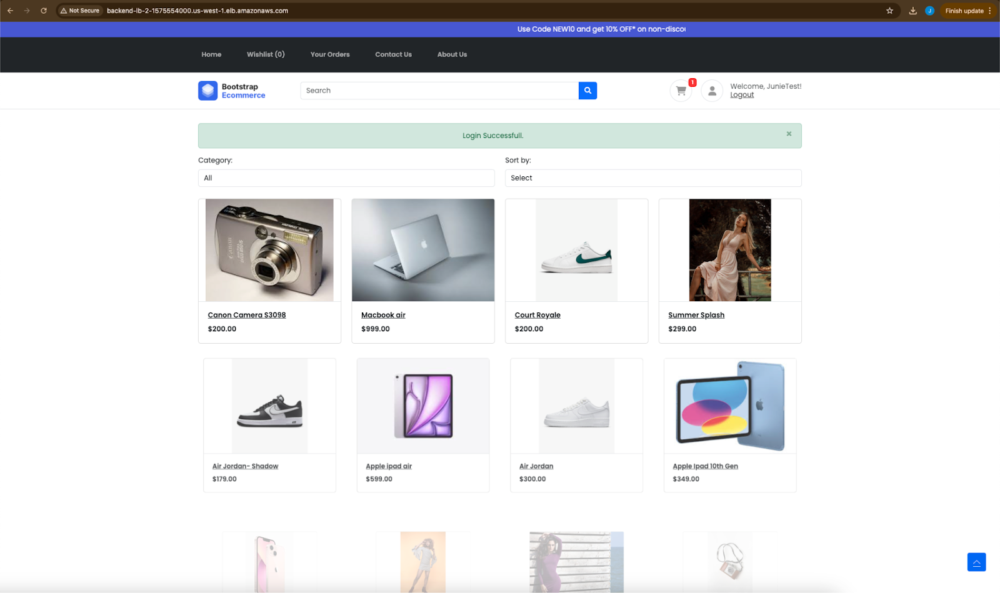
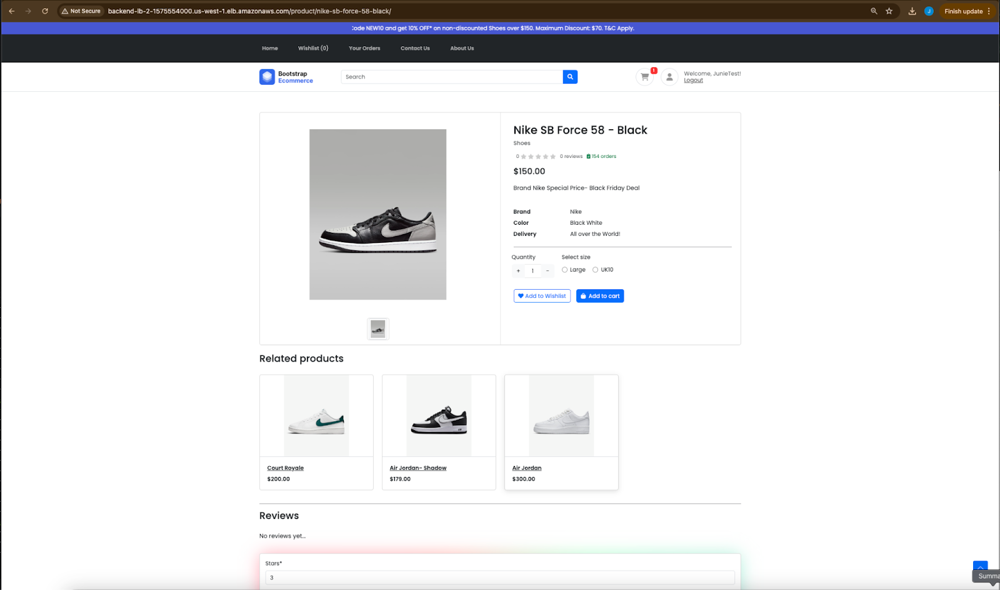
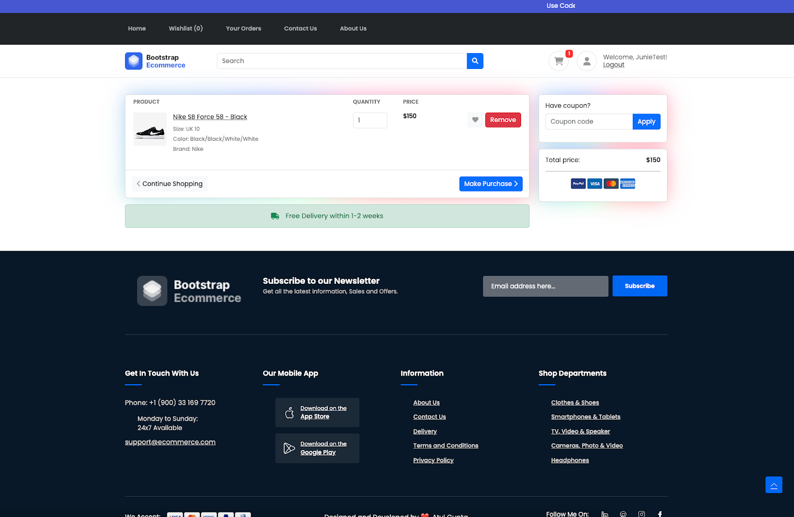
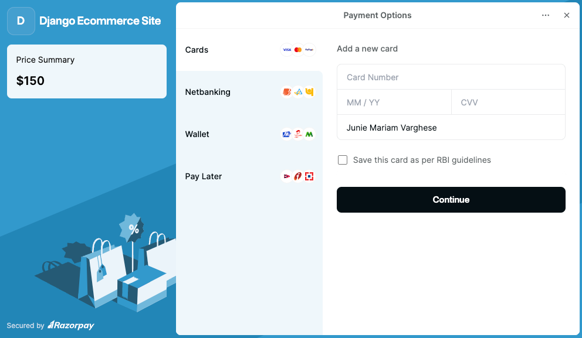

# ECommerce Website

This project is a comprehensive eCommerce platform developed with Django, a powerful Python web framework. It offers key features such as user authentication, product catalog browsing, shopping cart functionality, a streamlined checkout process, and payment gateway integration. Designed for robustness and scalability, the website ensures a smooth and user-friendly shopping experience, catering to the needs of both customers and administrators.

## Table of Contents
- [Features](#features)
- [Screenshots](#screenshots)
- [Technologies Used](#technologies-used)
- [Setup Instructions](#setup-instructions)
- [Usage](#usage)
- [Deployment](#deployment)

## Features
- **User Authentication:** Secure user registration, login, reset password, and profile management.
- **Product Catalog:** Browse and search products with detailed descriptions and images.
- **Shopping Cart:** Add, update, and remove items from the cart seamlessly.
- **Checkout Process:** Smooth checkout flow with order summary and address management.
- **Payment Integration:** Integrated with Razorpay for secure online payments.
- **Order Management:** View order history and status updates.
- **Responsive Design:** Mobile-friendly UI ensuring a consistent experience across devices.
- **Admin Panel:** Manage products, orders, and users efficiently through Django's admin interface.

## Screenshots

### Home Page


### Login Page


### Register Page


### Product Page


### Product Detail Page


### Order Details Page


### Payment Page



## Technologies Used
- **Django:** Python-based web framework for backend development.
- **HTML/CSS/JavaScript:** Frontend development for a responsive and interactive UI.
- **Razorpay API:** Payment gateway integration for secure transactions.
- **Bootstrap:** Frontend framework for responsive design and UI components.

## Setup Instructions
To run this project locally, follow these steps:

1. **Clone the repository:**
   ```bash
   git clone https://github.com/juniemariam/ECommerceWebApp.git
   cd ECommerceWebApp
   ```

2. **Create a virtual environment:**
   ```bash
   python -m venv venv
   ```
   
3. **Activate the virtual environment:**
   - On Windows:
     ```bash
     .\venv\Scripts\activate
     ```
   - On macOS/Linux:
     ```bash
     source venv/bin/activate
     ```

4. **Install dependencies:**
   ```bash
   pip install -r requirements.txt
   ```

5. **Apply database migrations:**
   ```bash
   python manage.py migrate
   ```

6. **Create a superuser (admin):**
   ```bash
   python manage.py createsuperuser
   ```

7. **Start the development server:**
   ```bash
   python manage.py runserver
   ```

8. **Open your web browser and navigate to:**
   ```
   http://127.0.0.1:8000/
   ```

## Usage
- **Admin Panel:** Access the admin panel at `http://127.0.0.1:8000/admin/` to manage products, orders, and users.
- **Shopping:** Browse products, add items to the cart, proceed to checkout, and make payments using Razorpay.
- **Profile:** Users can register, login, reset their password, view their order history, and update their profiles.

## Deployment
The infrastructure for hosting this eCommerce website is managed using Terraform. You can find the Terraform configuration files and setup instructions in the [ecommerce-terraform-infra](https://github.com/juniemariam/terraform-ecommerce-aws-hosting) repository.

Follow the steps outlined in the Terraform repository to provision the necessary AWS resources and deploy this project.


